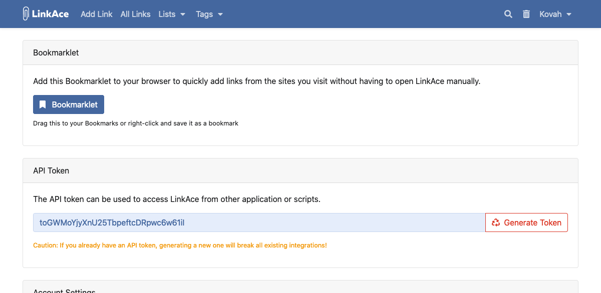

# Getting started


The LinkAce API is a clearly structured API to access and modify the data stored in your LinkAce setup. All data must be sent via JSON and JSON is used to return any data or messages.


## Generating an API key

To use the API, you have to generate an API key in the LinkAce user settings.

If you have an API key already, use this one. Else click the "Generate Token" to generate a new one.




## Using the API key

It highly depends on the system you use to work with the LinkAce API. In this example we do a simple request via Curl. We will create a new link.

* Replace `http://your-linkace-url.com` with your actual domain you use to access your LinkAce.
* Replace `YOUR-API-KEY-HERE` with the API key you got from the user settings.
* Fill the data JSON block with the actual data of the link you want to save.

```
curl --request POST \
  --url http://your-linkace-url.com/api/v1/links \
  --header 'accept: application/json' \
  --header 'authorization: Bearer YOUR-API-KEY-HERE' \
  --data '{
    "url":"https://duckduckgo.com",
    "title":"DuckDuckGo",
    "description":"",
    "lists":[],
    "tags":[],
    "is_private":false,
    "check_disabled":false
    }'
```

After sending the request with the HTTP status `200`, you will get a response that may look like this:

```
{
  "id": 1
  "url": "https://duckduckgo.com",
  "title": "DuckDuckGo",
  "description": "",
  "is_private": false,
  "user_id": 1,
  "icon": "fa fa-link",
  "updated_at": "2020-03-09T19:33:23.000000Z",
  "created_at": "2020-03-09T19:33:23.000000Z",
}
```
